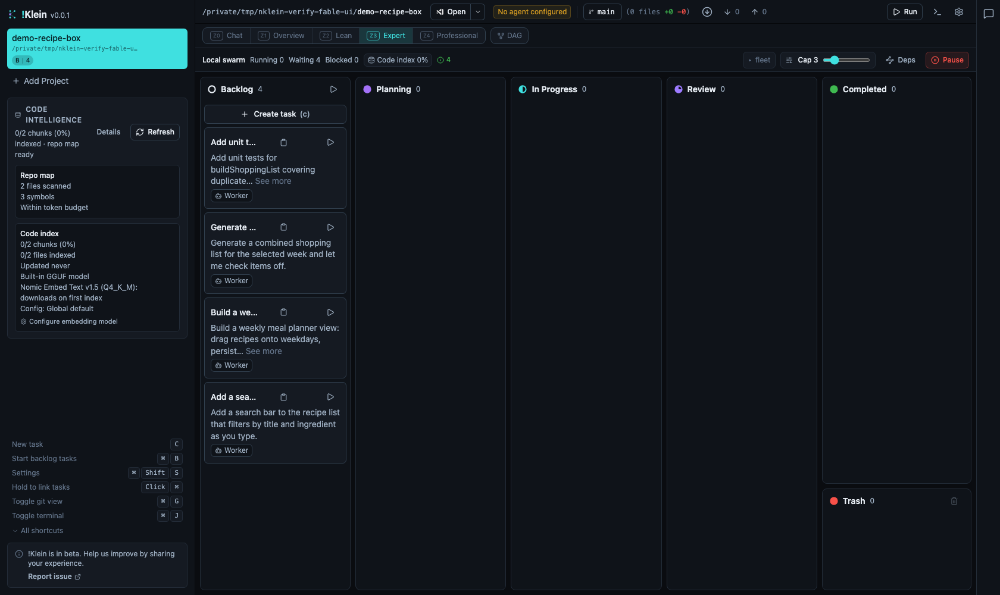
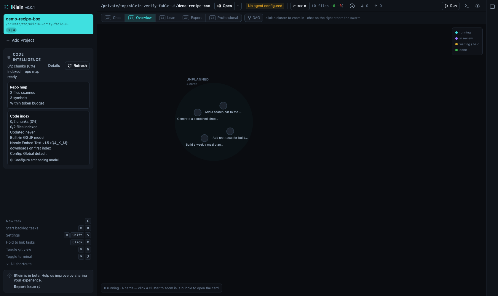

# !Klein

!Klein is a local-first orchestration board for running coding agents in parallel. It is forked from Cline Kanban, but the user-facing tool name is now `!Klein` and the command-line entry point is `nklein`.

The main driver for this fork is making agentic coding usable with small local LLMs on limited hardware. It began as a short, practical punch-list of things that got in the way of driving Cline Kanban with a small local model:

- long local-model turns hitting HTTP **body-timeout errors**;
- being able to **clear an agent's chat**;
- a **model selector on each card**, so different work can run on different local models;
- finer **context-management control** on every agent interaction, plus prompts that are careful about context size;
- the editor's **~6000-character edit limit** — detect that early and work in chunks instead of failing;
- **better tool use**, starting with git.

Fixing those one by one kept pulling in the next thing, and the project just kept going — into local-only model routing, larger effective context windows, task decomposition, guardrails, and recovery flows that make smaller models easier to use productively.

Naming, for consistency across docs, UI, and tooling: the **product** is `!Klein`, the **CLI / command** is `nklein`, and the **repository and npm package** are `nklein`. The word "kanban" is retained only where it refers to the board concept itself (columns, cards, WIP) — not to this product, which is `!Klein`.

### Install and Run

```bash
# Run directly
npx nklein

# Or install globally
npm i -g nklein
nklein
```

Run `nklein` from a git repository to open that project, or launch it without a project and add one from the UI.

### What It Does

- Runs many coding-agent tasks in parallel, each with its own task card, isolated in a hardened Docker sandbox.
- Runs entirely on LOCAL models. There is no cloud provider path — `CLOUD_ENABLED = false` is a prime directive,
  not a default you can flip.
- Decomposes larger requests into linked task cards SIZED for the models you actually have loaded, and routes each
  card to the model whose measured capability fits it.
- Verifies work with deterministic checks before it asks a model to judge anything, and tells you what it could
  NOT verify rather than reporting silence as success.
- Surfaces runtime state, diffs, review actions, merge actions, and recovery controls in a local web UI.
- Targets consumer hardware: 4B–32B models, constrained context budgets, and multiple machines when you have them.

### Screenshots

The board at the Expert zoom level — columns, cards, the swarm status strip, and the five-level zoom ladder (Chat → Overview → Lean → Expert → Professional):



The Overview zoom — cards rolled up into status clusters, built for a quick "what needs me?" read:



### Fork Direction

!Klein may periodically check whether upstream Cline Kanban changes are worth integrating. It does not treat upstream parity as a primary goal. This codebase is moving forward around the needs that prompted the fork: local LLM reliability, limited-hardware usability, and practical small-model orchestration.

The agent engine underneath is the **Cline SDK** (`@cline/*`, Apache-2.0), which we keep as our base. We vendor its **source** — not the prebuilt npm bundles — under [`vendor/cline-sdk/`](./vendor/cline-sdk/NOTICE.md) and build it ourselves, for two reasons: a hard safety net (if upstream ever disappears or unpublishes, the buildable source still lives in this repo), and deep control over internals such as context/compaction budgeting that small, slow, local models need. We treat Cline as a base we build on, not a path we follow by default: we pull upstream changes **selectively, only when they benefit !Klein**, and we patch our own copy when upstream steers away from our local-only, small-model direction. Attribution and license are kept fully intact — see the [NOTICE](./vendor/cline-sdk/NOTICE.md) and its patch ledger. We aim to be **strong** about our direction and **fair** to the source.

### Development

```bash
npm run install:all
npm run dev:full
```

On Windows, run `start.bat` from the repository root. It checks the required local tools, installs missing
dependencies, and starts the same full development runtime.

See [DEVELOPMENT.md](./DEVELOPMENT.md) and [docs/architecture.md](./docs/architecture.md) for the current engineering notes.

### License

[Apache 2.0 © 2026 !Klein contributors](./LICENSE) — a fork of Cline Kanban; see [NOTICE](./NOTICE) for upstream attribution.
