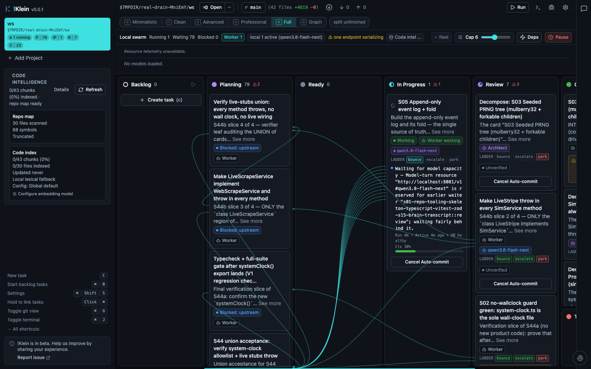
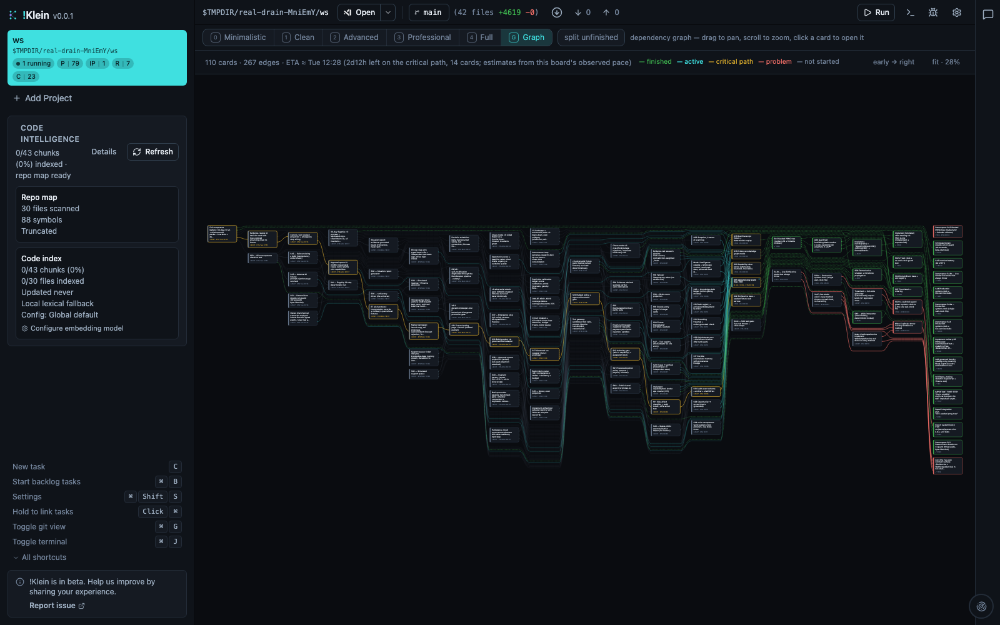
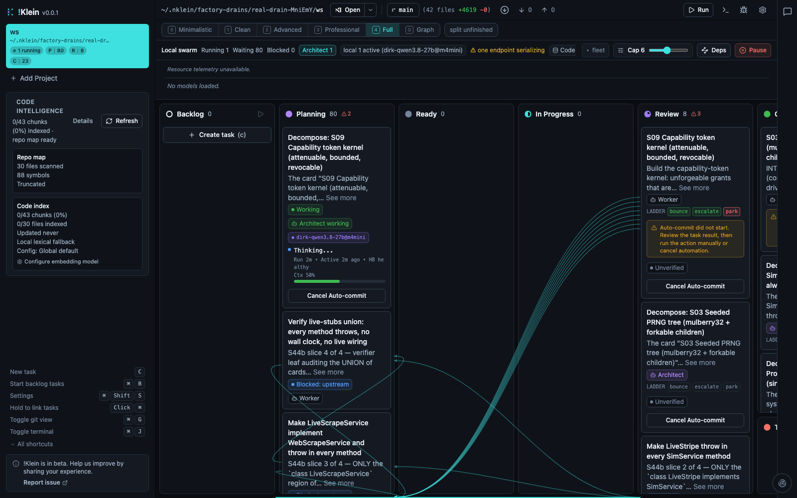
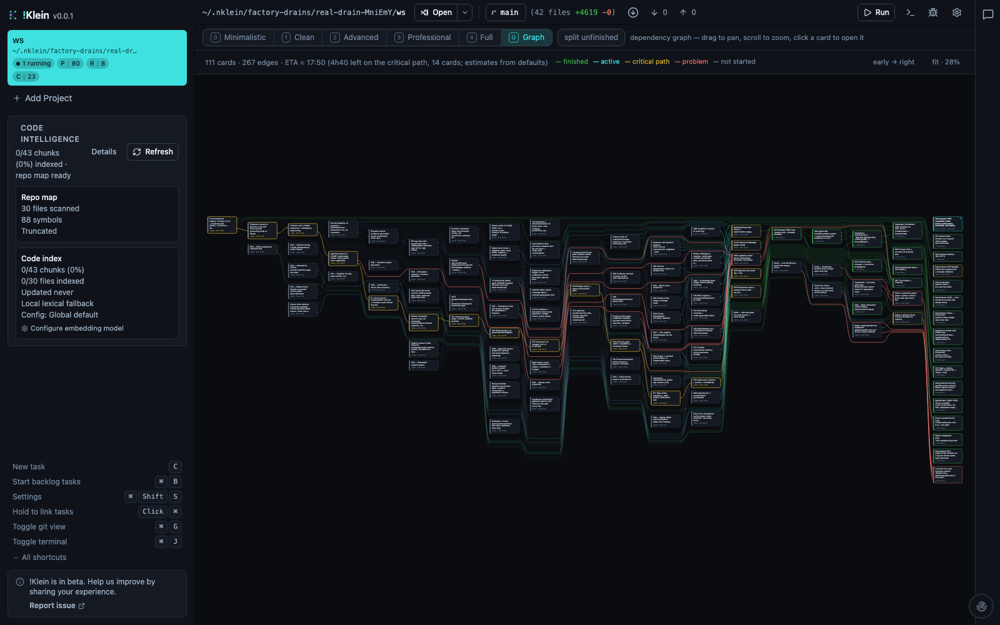

# !Klein drives dschinn — progress journal

Dated entries appended by `scripts/dschinn-journal.ts` (screenshots of the live board + graph, lane counts, fleet, fitness table, merge history) plus a human note about what changed. Newest at the bottom.

## 2026-09-06 00:23 — v31

First journal entry. Where !Klein stands driving the dschinn build (v31 drain, started 2026-09-02): 23 of 110 cards completed, the 4-file s03 merge conflict that blocked 77 cards was resolved by the merge-resolution agent after six rounds of fixes (git identity in the sandbox reproduction, 10→30→60 min deadline, conflict hunks seeded into the prompt, the worker's 80k context wrongly inherited, cross-round progress + salvage), and the fleet now runs flash-next (m5max, 262k ctx, parallel 1) plus three 27B instances on the M1, legion5pro and m4mini via LM-Link over an Android hotspot. Open pain: reviewers ending without a verdict (fixed tonight: reviewer tie-break + output-budget clamp), verification-only cards looping on the test-driven gate, and the sandbox image rebuild still pending. Also new tonight: !Klein's own project board (F2.36) mirrors this repo's plan and travels with git.

- **Lanes:** backlog 0 · planning 79 · ready 0 · in_progress 1 · review 7 · completed 23 · trash 0
- **Fleet:** qwen3.8-flash-next (local, ctx 262144, processingPrompt); dirk-qwen3.8-27b (local, ctx 60160, idle); dirk-qwen3.8-27b@m4mini (local, ctx 32768, idle)
- **Merges:** 15 ok / 49 recorded merge passes
- **Fitness (most-sampled cells):**

| model | role | tier | n | success | confidence |
|---|---|---|---|---|---|
| qwen3.8-flash-next | worker | easy | 57 | 91% | high |
| dirk-qwen3.8-27b@q2_k_xl | worker | easy | 31 | 100% | high |
| qwen/qwen3.8-27b | worker | easy | 19 | 89% | high |
| dirk-qwen3.8-27b@q6_k | worker | easy | 15 | 100% | high |
| ornith-1.0-9b@q4_k_m | worker | easy | 10 | 100% | high |
| dirk-qwen3.8-27b@iq4_xs | worker | easy | 8 | 88% | medium |
| dirk-qwen3.8-27b@q2_k_xl | architect | easy | 4 | 100% | medium |
| dirk-qwen3.8-27b@q6_k | architect | easy | 3 | 100% | medium |
| qwen/qwen3.8-27b | architect | easy | 3 | 100% | medium |
| qwen3.8-flash-next | architect | easy | 3 | 100% | medium |

## 2026-09-06 13:09 — v31

Overnight the factory crawled to 7–18 requests/hour: flash-next had been reloaded at 262k context, pushed the m5max 9 GB into swap and wedged the LM Studio daemon (only 'lms server stop/start' cleared PROCESSINGPROMPT; reloaded at 131072/parallel 1). Then at 03:41 macOS dirhelper (daily 03:35, 3-day rule) swept the drain root — it lived in /var/folders/…/T — and deleted the provider selection, providers.json, the workspace index and the replica id; every start refused 'No native !Klein provider is configured' for nine hours, hidden inside the bounced-redrive livelock (≈1400 refusals, fixed in 64ba3594e), and after the 12:18 restart the auto-start guard paused the only ready card. Fixes shipped (521969a4b, P0.TMPSWEEP): provider-selection self-heal from the model registry, a boot warning for temp-folder runtime homes, and guard holds released once per boot. The drain root now lives under ~/.nklein/factory-drains (symlink at the old path). After the 13:07 restart four reviews restarted immediately and the redecompose card attempted on dirk@m4mini.

- **Lanes:** (board file not given)
- **Fleet:** qwen3.8-flash-next (local, ctx 131072, processingPrompt); dirk-qwen3.8-27b@m4mini (local, ctx 32768, processingPrompt); dirk-qwen3.8-27b (local, ctx 60160, processingPrompt)
- **Merges:** (no merge history)
- **Fitness (most-sampled cells):**

| model | role | tier | n | success | confidence |
|---|---|---|---|---|---|
| qwen3.8-flash-next | worker | easy | 62 | 92% | high |
| dirk-qwen3.8-27b@q2_k_xl | worker | easy | 32 | 100% | high |
| dirk-qwen3.8-27b@q6_k | worker | easy | 21 | 100% | high |
| qwen/qwen3.8-27b | worker | easy | 19 | 89% | high |
| ornith-1.0-9b@q4_k_m | worker | easy | 10 | 100% | high |
| dirk-qwen3.8-27b@iq4_xs | worker | easy | 8 | 88% | medium |
| dirk-qwen3.8-27b@q2_k_xl | architect | easy | 4 | 100% | medium |
| dirk-qwen3.8-27b@q6_k | architect | easy | 4 | 100% | medium |
| qwen/qwen3.8-27b | architect | easy | 3 | 100% | medium |
| qwen3.8-flash-next | architect | easy | 3 | 100% | medium |

